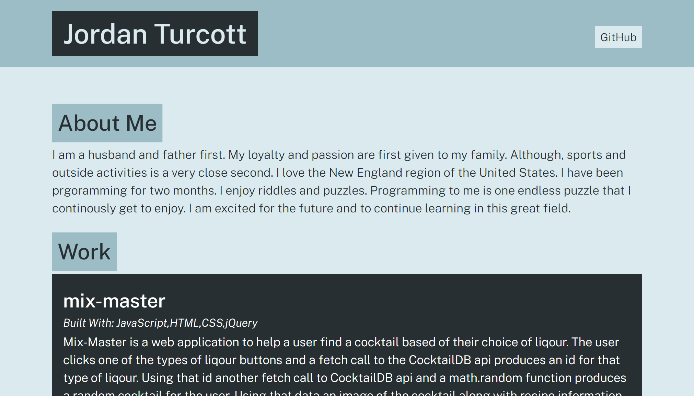

# portfolio-generator

## Description
- This application is done through Node.js.  To utilize this application you will need to clone this repository locally to your computer.
- If you have Node.js on your machine open the command line.  Navigate to the location you cloned the repository.  In the command line type 'node app' and you should be prompted to enter information to build a portfolio of your work.  Hit enter and an index.html file should be created in your dist folder.  Open that in your default browser and WA-LAH you have a portfolio html file to copy into another folder to display.

## Screenshot of created portfolio page
